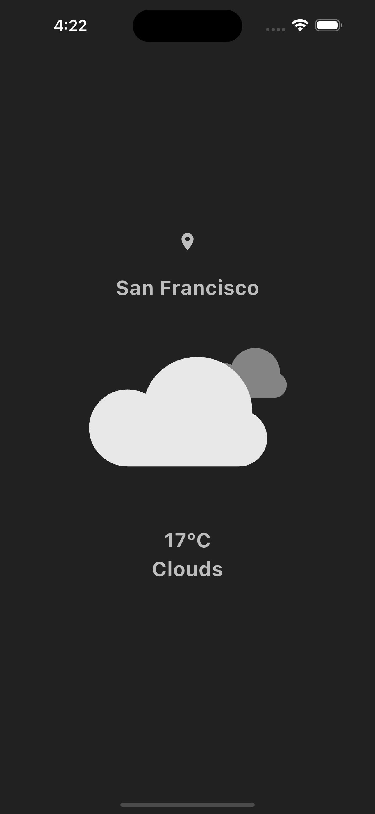

### **Weather App ⛅**

Welcome to my **first project**! 🚀 This is a **cool weather app** with:

✅ **Smooth Animations** 🎨  
✅ **Auto Geo-Location Detection** 📍  
✅ **Clean and Modern UI** ✨

---

### **📸 Screenshots**


---

### **🚀 Features**
- 🌍 Detects your **current location** automatically
- 🌤️ Shows **real-time weather updates**
- 🏙️ Search for any **city worldwide**
- 🎨 **Beautiful animations** based on weather

---

### **🛠️ Tech Stack**
- **Flutter** (Dart)
- **Weather API** (e.g., OpenWeatherMap)

---

### **📦 Installation**
1. Clone the repository
   ```sh
   git clone https://github.com/Prince-Moiz/weather_app.git
   cd weather_app
   ```  
2. Install dependencies
   ```sh
   flutter pub get
   ```  
3. Run the app
   ```sh
   flutter run
   ```

---

### **🔗 API Setup**
1. Get an API key from **[OpenWeatherMap](https://openweathermap.org/)**
2. Add it to your project

---

### **📜 License**
This project is **free to use**. 🚀

